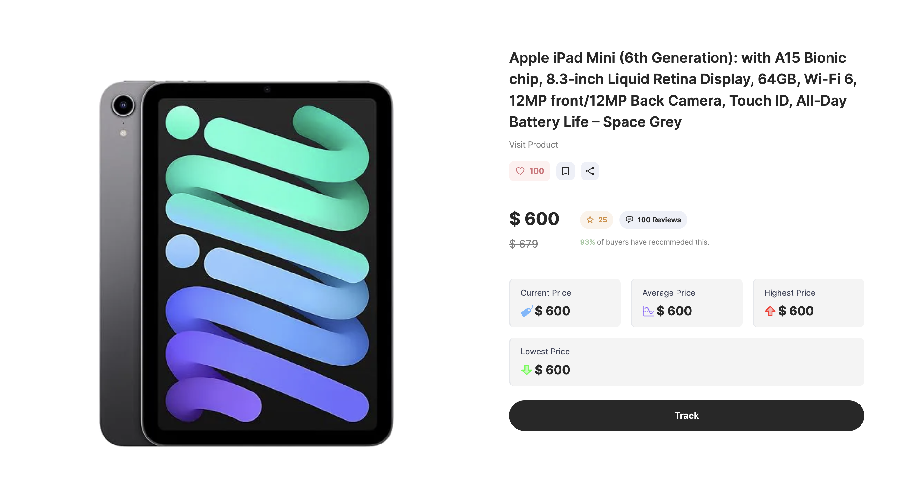

# PriceMe 🛒
PriceMe is a powerful web application that helps you stay updated on the latest prices of your favorite Amazon products. With PriceMe, you can receive email notifications as soon as a product's price drops, keeping you informed and saving you money. This project leverages a variety of technologies to provide a seamless and efficient user experience.

## Features ⚙️



- <strong>Email Notifications</strong>: PriceMe allows you to receive email updates as soon as the price of a product you're interested in drops. We use NodeMailer to ensure that you are always informed of the latest deals.
- <strong>CAPTCHA Bypass</strong>: We make use of Bright Data to get past CAPTCHAs and other website blocking mechanisms, ensuring that our web scraping remains uninterrupted and reliable.
- <strong>Web Scraping</strong>: PriceMe webscrapes Amazon for product information, including product name, star ratings, reviews, and prices. This data is essential for providing you with up-to-date information on your favorite products.
- <strong>Database Management</strong>: We use MongoDB with Mongoose to manage changes in product prices and store other relevant information. This allows us to keep track of price history and provide you with a comprehensive overview.
- <strong>Automation with Cron Jobs</strong>: PriceMe utilizes cron jobs to automate various tasks. These scheduled functions help us fetch new data on demand or at specified intervals, ensuring that you always have the latest information at your fingertips.
- <strong>Live Product Information</strong>: PriceMe offers live information about a product, including its name, star ratings, reviews, and various price metrics such as average price, highest price, lowest price, and the current price.
- <strong>User Engagement</strong>: You can interact with PriceMe by liking a product, bookmarking it for future reference, and sharing it with others. These features enhance your user experience and help you keep track of products you're interested in.

## Tech Stack 💻
```Next.js``` ```TypeScript``` ```MongoDB``` ```AWS``` ```TailwindCSS``` ```Git``` ```Vercel```

## Getting Started 🚀

To get started with PriceMe, simply click this <a href="https://priceme-chi.vercel.app/">link</a> which directs you to the PriceMe website. Make sure to enter your email to stay up to date with the latest price changes within your selected inventory. And that's it, it's that simple. You'll be up and running in no time, ready to start saving money by tracking your favorite products on Amazon.

Feel free to contribute to the project or report any issues you encounter. We're committed to making PriceMe the best tool for tracking Amazon product prices with your user experience our first priority, and your feedback is valuable.

### Happy shopping with PriceMe!

### Disclaimer ❗
This project is only a beta release. Future releases will present a more complete version of PriceMe with account logins, additional features such as removing products and much more. Feel free to stay up to date with PriceMe by starring this repo 🙂.
